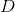
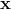

# Decision Tree

###Representation

###Learning

Denote the set of features by 
and the set of classes by .
Starting with the full training data  of size , 
we grow a tree by splitting data at each node into two parts according to the values of a selected feature, 
until no more split can be generated (or some regularization techniques are applied). 

Conceptually, we want to split the data at a node such that the division of class labels becomes clearer at the two children nodes. 
Technically, we choose the most _informative_ feature at each node, 
and the split results in the biggest reduction in _uncertainty_.

The math below defines the measure of _uncertainty_ and specifies what we exactly mean by an _informative_ feature.

Given the training data  of size  at node ,
the frequency of samples in class  is

where  is a sample in  and y is its label.

There are two common measures of uncertainty (or impurity):

To understand these measures, we consider a binary problem with classes 0 and 1, 
and plot gini score and entropy against .

It is easy to see that both measures reach the maximum when , which agrees with our intuition.

Given feature ,

where

Split with the feature  that reduces uncertainty the most:

To avoid overfitting, we may tune the following hyperparameters to regularize decision tree learning.

- the maximum depth of the tree
- the minimum number of samples required to split a node
- the minimum number of samples required to be at a leaf node
- the maximum number of leaf nodes
- the minimum decrease in uncertainty required for learning to continue
- the minumum uncertainty required for splitting a node

###Inference

Given a new sample , 
move down the tree by choosing the right path at each split.
Finally, you end up in a leaf node that tells you which class the sample belongs to.

###Example

> #### Further readings
> 1. sklearn [tutorial](http://scikit-learn.org/stable/modules/tree.html) on Decision Trees.
> 2. sklearn `DecisionTreeClassifier` [documentation](http://scikit-learn.org/stable/modules/generated/sklearn.tree.DecisionTreeClassifier.html#sklearn.tree.DecisionTreeClassifier).
