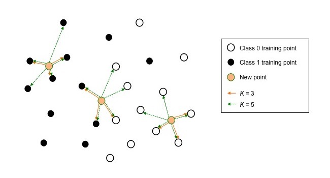
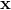
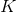
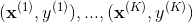
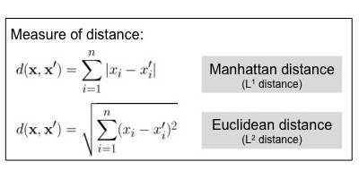
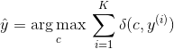
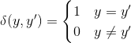
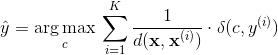

# K-Nearest Neighbors

###Representation

###Learning

None.

###Inference

Given a new point , find  training points 

that are closest to it.

For continuous features, commonly used distance measures are

For discrete features, the similarity of two samples is measured by **Hamming distance**, 
which counts how many feature values are different between the two samples.

Then, the class of  is determined by

where

In the weighted version, the neighbors are weighted by their distance to the new point.

###Example

> #### Further readings
> 1. sklearn [tutorial](http://scikit-learn.org/stable/modules/neighbors.html) on Nearest Neighbors.
> 2. sklearn `KNeighborsClassifier` [documentation](http://scikit-learn.org/stable/modules/generated/sklearn.neighbors.KNeighborsClassifier.html).
