# Logistic Regression

### Representation

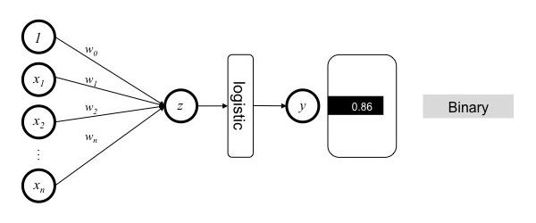

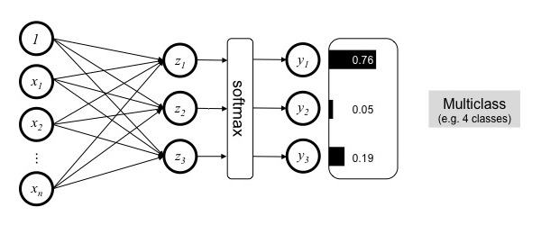

### Inference

Given a new sample, we denote it by

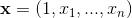

where the first element is the **bias** term and the others are the feature values.

- **Binary problem**
	
	Consider a binary classification task with a positive class and a negative class.
	
	Denote

	

	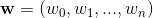
	

	
	Then
	
	

	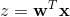
	

	
	and the probability that the new sample is positive is
	
	

	
	

- **Multiclass problem**
	
	Consider a multiclass classification task with classes .
	
	Denote
	
	

	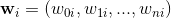
	

	
	Then
	
	

	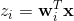
	

	
	and the probability that the new sample belongs to class 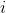 is
	
	

	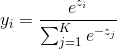
	

### Learning

- **Binary problem**

	

	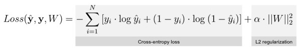

	
	

- **Multiclass problem**

	

	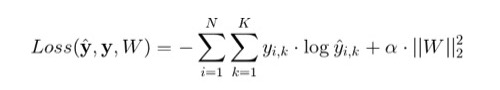
	

In both cases,  is a vector containing all weights, 
and  is a constant 
that determines the strength of regularization.

### Software

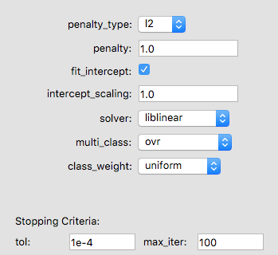

- **penalty_type**: the norm used in the regularization term (_L1_ or _L2_)
- **penalty**: inverse of regularization strength  (i.e. larger values lead to weaker regularization.)
- **fit_intercept**: whether to use a bias term
- **intercept_scaling**: scale of the bias term
- **solver**: learning algorithm used to optimize the loss function
- **multi_class**: mode for multiclass problems
	- _ovr_: one vs. all (one classifier for each class)
	- _multinomial_: one classifier for all classes
- **class_weight**: weights associated with the classes
	- _uniform_: every class receives the same weight.
	- _balanced_: class weights are inversely proportional to class frequencies.

Stopping criteria:

- **tol**: minimum reduction in loss required for optimization to continue.
- **max_iter**: maximum number of iterations allowed for the learning algorithm to converge. 

Check out the documentation listed below to view the attributes that are available in sklearn but not exposed to the user in the software.

> #### Further readings
> 1. sklearn [tutorial](http://scikit-learn.org/stable/modules/linear_model.html) on linear models (including Logistic Regression).
> 2. sklearn `LogisticRegression` [documentation](http://scikit-learn.org/stable/modules/generated/sklearn.linear_model.LogisticRegression.html)

