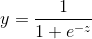
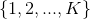
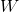

# Logistic Regression

### Representation

### Inference

Given a new sample, we denote it by

where the first element is the **bias** term and the others are the feature values.

- **Binary problem**
	
	Consider a binary classification task with a positive class and a negative class.
	
	Denote

	

	
	

	
	Then
	
	

	
	

	
	and the probability that the new sample is positive is
	
	

	
	

- **Multiclass problem**
	
	Consider a multiclass classification task with classes .
	
	Denote
	
	

	
	

	
	Then
	
	

	
	

	
	and the probability that the new sample belongs to class  is
	
	

	
	

### Learning

- **Binary problem**

	

	

	
	

- **Multiclass problem**

	

	
	

In both cases,  is a vector containing all weights, 
and  is a constant 
that determines the strength of regularization.

### Example

> #### Further readings
> 1. sklearn [tutorial](http://scikit-learn.org/stable/modules/linear_model.html) on linear models (including Logistic Regression).
> 2. sklearn `LogisticRegression` [documentation](http://scikit-learn.org/stable/modules/generated/sklearn.linear_model.LogisticRegression.html)

