# Naïve Bayes

### Representation

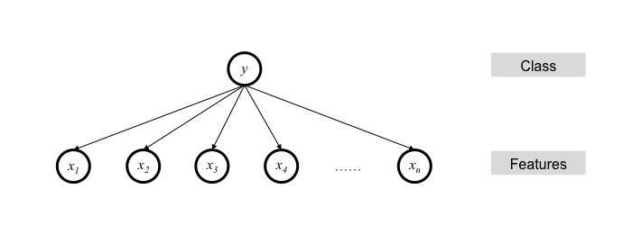

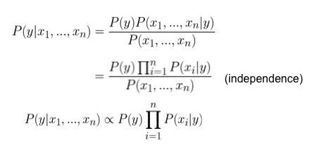
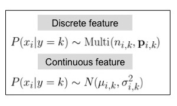

### Learning

Denote the set of features by 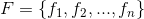, 
and the set of classes by 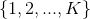.

Given the full training data  of size 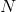, 
let 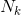 be the number of samples that belong to class .
We estimate the frequency of each class by

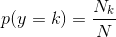

For a discrete feature 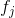,

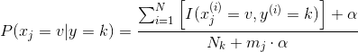

where  is the **smoothing prior** 
and 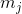 is the total number of 
values of .

For a continuous feature ,
the parameters of 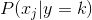 
are estimated by maximum likelihood estimation.

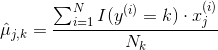

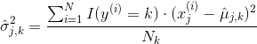

### Inference

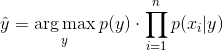

For numerical stability, you may instead compute

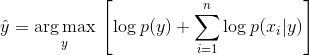

### Software

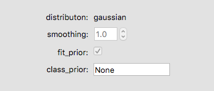

- **distribution**: the form of distribution for 
- **smoothing**: additive smoothing parameter
- **fit_prior**: whether to learn class prior probabilities from data
- **class_prior**: user-specified prior probabilities of the classes

Check out the documentation listed below to view the attributes that are available in sklearn but not exposed to the user in the software.

> #### Further readings
> 1. sklearn [tutorial](http://scikit-learn.org/stable/modules/naive_bayes.html) on Naïve Bayes.
> 2. sklearn `LogisticRegression` [documentation](http://scikit-learn.org/stable/modules/generated/sklearn.linear_model.LogisticRegression.html).
