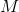

# Neural Networks

### Representation

### Inference

Given a new sample, we denote it by

where the first element is the **bias** term and the others are the feature values.

- **Binary problem**
	
	Consider a binary classification task with a positive class and a negative class.
	
	Denote the nodes in the hidden layer by  
	and the incoming weights to  by
	
	

	
	

	
	Then
	
	

	
	

	
	and
	
	

	
	

	
	where  is an activation function of your choice.
	
	Using similar notations, we have
	
	

	
	

	
	

	
	

	
	

	
	

	
	and the probability that the new sample is positive is
	
	

	
	

- **Multiclass problem**

	Consider a multiclass classification task with  classes .
	
	Using the same notation as above, we have
	
	

	
	

	
	

	
	

	
	

	
	

	
	

	
	

	
	Then, define
	
	

	
	

	
	We then get
	
	

	
	

	
	and the probability that the new sample belongs to class  is
	
	

	
	

- **Activation functions**

	

	
	

### Learning

- **Binary problem**

	

	
	
	

- **Multiclass problem**

	

	
	

In both cases,  is a vector containing all weights, 
and  is a constant 
that determines the strength of regularization.

### Software

- **num\_hidden\_units**: the number of units in the hidden layer
- **activation**: the activation function for the hidden layer
- **solver**: learning algorithm used to optimize the loss function
- **penalty**: regularization strength  (i.e. larger values lead to stronger regularization.)
- **batch_size**: the number of samples in each batch used in stochastic optimization
- **learning_rate**: learning rate schedule for weight updates
	- _constant_: uses constant rate given by **learning\_rate\_init**.
	- _invscaling_: the learning rate gradually decreases from the initial rate given by **learning\_rate\_init**.
	- _adaptive_: the learning rate is divided by 5 only when two consecutive iterations fail to decrease the loss. The initial rate is given by **learning\_rate\_init**.
- **learning\_rate\_init**: the initial learning rate
- **early_stopping**: whether to terminate learning if validation score fails to improve

Stopping criteria:

- **tol**: minimum reduction in loss required for optimization to continue.
- **max_iter**: maximum number of iterations allowed for the learning algorithm to converge. 

Check out the documentation listed below to view the attributes that are available in sklearn but not exposed to the user in the software.

> #### Further readings
> 1. sklearn [tutorial](http://scikit-learn.org/stable/modules/neural_networks_supervised.html) on neural networks.
> 2. sklearn `MLPClassifier` [documentation](http://scikit-learn.org/stable/modules/generated/sklearn.neural_network.MLPClassifier.html#sklearn.neural_network.MLPClassifier).
> 3. Stanford CS231n [lecture note](http://cs231n.github.io/neural-networks-1/) on neural networks.

