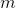

# Random Forest

### Representation

### Learning

Given the full training data  
and the feature set , we train  randomized decision tree.

For tree ,

- Sample  with replacement to create a new dataset .

- To choose a split at a node, 
sample  features without replacement from  (where ) to create a subset of features . Choose the best split from .

The intuition is that each randomized tree has increasing _bias_ compared to a tree that utilizes full data and feature set, but the **ensemble** of randomized trees enables reduction in _variance_ in performance. 

As with decision tree learning, we can regularize the randomized trees by limiting their maximum depth, the minimum number of samples at a leaf, the total number of leaves, etc.

### Inference

Given a new sample , feed it to the trees in the forest.
Each tree will produce a class label for , and the final label is determined by a majority vote. Sometimes (as in sklearn), each tree will produce a probability for each class instead of a concrete label. In such case, we average over the predicted probabilities for each class across all trees. The final label is the class with highest average probability.

### Example

> #### Further readings
> 1. sklearn [tutorial](http://scikit-learn.org/stable/modules/ensemble.html) on Ensemble methods (including Random Forest).
> 2. sklearn `RandomForestClassifier` [documentation](http://scikit-learn.org/stable/modules/generated/sklearn.ensemble.RandomForestClassifier.html).
