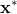

# Support Vector Machine (SVM)

### Representation

We consider the scenario where training points belong to one of the two classes {-1, 1}.

**Linear SVM**

We are interested in finding a _linear_ hyperplane that separates positive points from negative points. The goal of linear SVM learning is to find a hyperplane that trades off between

- maximizing the **margin**
- minimizing the **slack variables**

where margin size measures how separated positive and negative points are,
and slack variables determine how far a point is from the boundary of the side where it should have lied (i.e. allow some imperfectness).

**Kernel SVM**

Slack variables offer one option for classification of data that are not linearly separable. 
Another possibility is to map points into a higher dimensional space 
and find a hyperplane that separates the points in the new space.
Kernel SVM defines such mappings implicitly using **kernels**.
	 

	

	

### Learning

- **Linear SVM**

	Solve the constrained optimization problem
	
	

	
	

	
	Intuitively, the constant  accounts for the tradeoff between margin size and penalty on slack variables.
	
	We can rewrite the optimization problem above to obtain a more standard loss function.
	
	

	
	

	

- **Kernel SVM**

	Similarly, construct the objective function as in the case of linear SVM 
	except using the data representation in the high-dimensional space.
	
	

	
	

	
Instead of solving the **primal** formulations above, we turn to their **dual** formulations, which are easier to solve because the constraints are linear and the kernel trick can be easily applied.
	

where

for linear SVM, and

for kernel SVM.

### Inference

- **Linear SVM**

	Since
	
	

	
	

	we determine the class of a new point  by
	
	

	
	

	
	where
	
	

	
	

- **kernel SVM**

	

	
	

	

	Given a new point , we have
	
	

	
	

	
	and
	
	

	
	

	
	where  is some support vector.
	
	Therefore, we can determine the class of  by
	
	

	
	

### Software

- **penalty**: slack penalty strength  (i.e. larger values lead to fewer misclassifications.)
- **kernel**: the type of kernel used (_rbf_, _linear_, _poly_ or _sigmoid_)
- **degree**: the degree of polynomial in polynomial kernel
- **kernel_coef**: the cofficient  used in RBF, polynomial and sigmoid kernels
- **independent_term**: the independent term  in polynomial and sigmoid kernels
- **class_weight**: weights associated with the classes
	- _uniform_: every class receives the same weight.
	- _balanced_: class weights are inversely proportional to class frequencies.

Stopping criteria:

- **tol**: minimum reduction in loss required for optimization to continue.
- **max_iter**: maximum number of iterations allowed for the learning algorithm to converge. 

Check out the documentation listed below to view the attributes that are available in sklearn but not exposed to the user in the software.

> #### Further readings
> 1. sklearn [tutorial](http://scikit-learn.org/stable/modules/svm.html) on SVM.
> 2. sklearn `SVC` [documentation](http://scikit-learn.org/stable/modules/generated/sklearn.svm.SVC.html#sklearn.svm.SVC).
