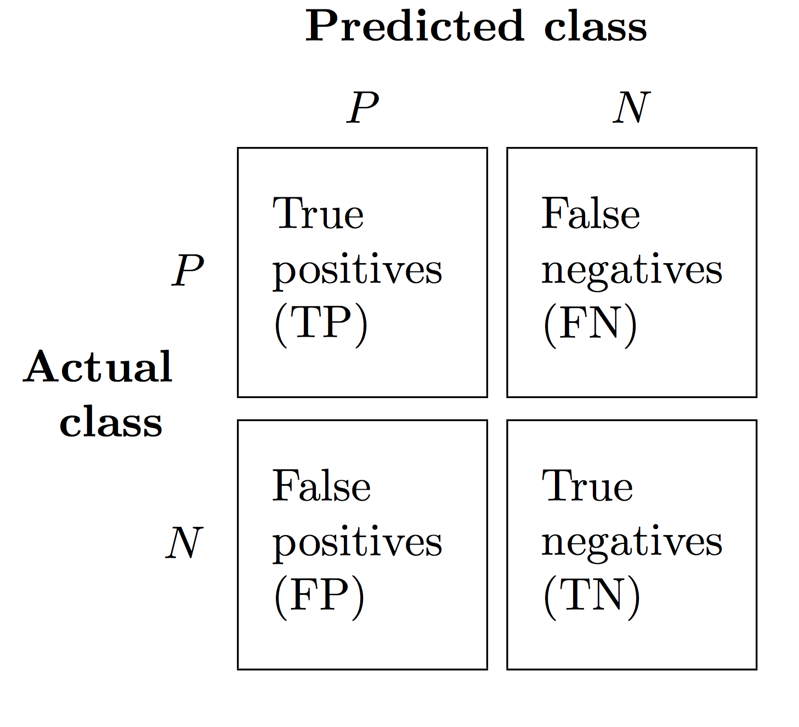

# More about performance: metrics and plots

> #### Questions
>
> 1.	How can I measure the quality of a classifier?
>
> #### Objectives
>
> 1.   Introduce useful metrics for evaluating a classifier's performance.
> 2.   Introduce plotting techniques for visual exploration of a classifier's performance.

In model validation / evaluation,
we ask our classifiers to predict labels given feature vectors in the validation or test set.
We compare the predicted labels and the true labels to get an idea of how well the classifiers perform.
Now we discuss the metrics and plots that quantitatively measure the quality of a classifier.

### Metrics

We first restrict our discussion to binary classification problems,
where a sample is either positive (P) or negative (N).
In practice, the two classes may have different names,
but we can always consider one as positive and the other as negative.
Given the true labels and the labels predicted by a classifier, a sample is a

- **true positive (TP)** if its true label is positive and it is also predicted to be positive.
- **true negative (TN)** if its true label is negative and it is also predicted to be negative.
- **false positive (FP)** if its true label is negative but it is predicted to be positive.
- **false negative (FN)** if its true label is positive but it is predicted to be negative.

If a sample is an FP or FN, we know the classifier made a mistake.
Given the definitions above, we can summarize the samples in a **confusion matrix**.

We count the number of TPs, TNs, FPs and FNs and populate the matrix.
In practice, we may choose to convert the counts into percents by dividing each entry by the row sum.
In this way, we get a better idea of how the classifier performs with respect to each class.

Now that we have defined some terms, we can use them to introduce some useful metrics.

#### Accuracy

Using the notations above, we write

In other words, it is the number of correctly predicted samples divided by the total number of samples.
Sometimes, people talk about **error rate**, which is .

Accuracy gains its popularity because of its simplicity,
but it is less useful when the classes are _imbalanced_,
i.e. when there are way more positive samples than negative samples or the other way around.
For example, if your dataset has 90 positives and 10 negatives,
you can easily reach 90% accuracy if you declare all samples as positives.
Obviously, such a classifier is useless even though its accuracy is high.

#### Precision

Intuitively, the question being asked is:
_Out of the samples predicted to be positive, how many of them are truly positive?_
Mathematically,

It measures how strongly we can believe the classifier's calls.
Another way of saying it is how aggressively the classifier is on making calls.
Precision is high for a conservative classifier but low for an aggressive classifier.

#### Recall

Intuitively, the question being asked is:
_How many of the truly positive samples can the classifier discover (or recall)?_
Mathematically,

It measures how sensitive the classifier is to interesting information.
Recall is high for an aggressive classifier but low for a conservative classifier.
Recall is also known as **sensitivity** in statistics.

#### F1 score

F1 score takes both precision and recall into account.
Mathematically,

For a conservative classifier, F1 score is dominated by recall.
For an aggressive classifier, F1 score is dominated by precision.
Given the discussion above,
a classifier that is either too conservative or too aggressive gets a low F1 score.
Therefore, F1 score encourages a _fair_ classifier.

All metrics discussed above lie between 0 and 1.
There are a lot more metrics available (see further readings), and you should choose the one that captures your concern.
For example, if your application is to screen for potential gene hits
that you will verify experimentally later
and the validation experiments are extremely expensive and time-consuming,
then you do not want to be misled by the classifier too often.
Precision is more important than recall.
Once you settled for a classifier with high precision,
you may further want to recover as many hits as possible.
Now you should consider boosting recall without losing too much precision.

We note that although we treated the positive class as the interesting one
and defined metrics with respect to it,
we can also define their counterparts for the negative class
since the two classes can be equally interesting in many applications.
For example, if your goal is to classify tumors into one of two subtypes,
there is no reason for only evaluating the classifier with respect to one subtype but not the other.

Furthermore, the metrics we defined above easily generalize when the number of classes grows.
In practice, people use the **one-v.s.-all** trick.
For each class, we consider the samples that belong to this class as positive,
and all other samples as negative.
In this way, we can compute, say precision, with respect to each class.

### Performance evaluation plots

Instead of directly making predictions on class labels,
many algorithms do _soft_ classification
by outputting a probability for each class given a feature vector.
For example, suppose the task is to predict drug toxicity according to gene expression levels.
A classifier may tell you that the probability of a drug being nontoxic is 0.9,
but there is still 10% chance that the drug is toxic.
By introducing uncertainty into prediction,
the classifier leaves room for the human user to tweak the decision threshold.
Notice that _different thresholds lead to different class predictions,
hence change the classifier performance._
Therefore, decision threshold is a hyperparameter of the classifier.

A natural decision threshold is 0.5, but it does not have to be the case.
In drug toxicity prediction, setting the threshold for calling a drug toxic to be 0.1
provides a better guarantee on the safety of drugs predicted to be nontoxic.

The ideas of probability estimation and thresholding are explored
by the two most popular performance plots, **receiver operating characteristic curve (ROC) curves** and **precision-recall (PR) curves**.
We begin by plotting these curves for binary classification problems
and later briefly comment on their generalization in multi-class problems and how to pick a reasonable decision threshold according to the plots.

#### ROC curves

We first define two more metrics.

- **True positive rate (TPR)** is the same as recall (or sensitivity).
It is the percent of truly positive samples
that are correctly predicted to be positive. Mathematically,

- **False positive rate (FPR)** is the percent of truly negative samples
that are falsely predicted to be positive. Mathematically,

In statistics, the counterpart of TPR for negative samples is called **specificity**
(i.e. the percent of truly negative samples that are correctly predicted to be negative),
and FPR is simply .

An ROC curve is created by plotting TPR against FPR at various thresholds.
Starting from 0, we increase the threshold until it reaches 1.
At a given threshold, we compute TPR and FPR based on the class predictions,
and add a point whose coordinate is (FPR, TPR) to the plot.
Finally, we connect the points and obtain the ROC curve.
The figure below shows an example ROC curve.

As with the metrics, we can plot an ROC curve with respect to each class.
We may use a micro- or macro-average ROC curve
to quantify the average behavior of a classifier on all classes.
A micro-average curve takes class imbalance into account,
but a macro-average curve does not.
For simplicity, the software only plots the classwise curves and their macro-average curve.

A few comments on ROC curves:

- In a perfect scenario, the ROC curve will go straight up the Y axis and then along the X axis.
The curve of a classifier that makes random guesses will lie on the diagonal.
Generally, a curve falls somewhere in between.

- The most straightforward measure for assessing an ROC curve
is to compute the **area under the ROC curve (AUROC)**.
In the plot above, the curve with respect to class 0 has the largest AUROC,
thus the classifier is best at predicting class 0.
The AUROC for a perfect curve is 1,
while the curve of a classifier that makes random guesses has AUROC equal to 0.5.
Generally, the larger AUROC is, the better the classifier is with respect to that class.

- As stated above, you may want to pick a decision threshold in applications such as gene screening.
ROC curves can help in such situations. Again, assume a binary classification problem.
_The best cutoff depends on the relative costs of misclassifications._

  - **The two classes have equal weight.**
  In other words, the cost of misclassifying positives and negatives are roughly equal.
  The best cutoff can be determined as follows.
  The slope of the black line is 1.
  The desired cutoff corresponds to where the line is tangent to the ROC curve.

	

	
	

  - **FN costs more than FP.**
  In other words, misclassifying a positive sample as negative
  has more serious consequence than the other way around.
  Consider cancer diagnosis, where someone who has cancer is a positive sample.
  We are prepared to waste time on ten healthy patients in exchange for identifying one cancer patient.
  The best cutoff can be determined as follows.
  The slope of the black line is 0.1.
  The desired cutoff corresponds to where the line is tangent to the ROC curve.

	

	
	

  - **FP costs more than FN.**
  In other words, misclassifying a negative sample as positive
  has more serious consequence than the other way around.
  Consider gene screening, where a hit is a gene responsible for the phenotype of interest.
  We are willing to miss ten hits in exchange for avoiding one artifact.
  The best cutoff can be determined as follows.
  The slope of the black line is 10.
  The desired cutoff corresponds to where the line is tangent to the ROC curve.

	

	
	

ROC curves suffer from the same limitation as accuracy when class imbalance exists.
To see why, think of ROC curve as measuring how fast FPR increases as TPR increases.
For a good ROC curve, the number of FPs remains small _relative to the total number of negatives_
by definition until TPR approaches 1.
However, this does not mean the number of FPs remains small _relative to the total number of positives_.
Note that

When there are a lot more negatives than positives, TP is no larger than a small number,
but it is easy to come up with a situation where FP can grow big very fast.
The end result is that even if ROC curve looks great, classifier precision drops quickly as TPR increases.
This is undesired for many applications.
(See Figure 4 of [this article](http://doi.org/10.1038/nmeth.3945) for a concrete example.)

#### PR curves

PR curve complements ROC curves because it takes better care of class imbalance.
As its name suggests, a PR curve is created by plotting precision against recall at various thresholds.
Starting from 0, we increase the threshold until it reaches 1.
At a given threshold, we compute precision and recall based on the class predictions,
and add a point whose coordinate is (recall, precision) to the plot.
Finally, we connect the points and obtain the PR curve.
The figure below shows an example PR curve.

As with ROC curve, we can plot a PR curve with respect to each class,
and average over the classwise curves to obtain a micro- or macro-averaged curve.
For simplicity, the software only plots the classwise curves and their macro-average curve.
Similar to AUROC, **area of the PR curve (AUPRC)** quantifies the quality of a PR curve.
The larger AUPRC is, the better the PR curve is.
It is clear from the figure below that the classifier is best at predicting class 0.

> #### Reference
>
> Images in this lesson are adapted from
>
> [https://github.com/rasbt/python-machine-learning-book-2nd-edition](https://github.com/rasbt/python-machine-learning-book-2nd-edition) Raschka and V. Mirjalili, Python Machine Learning (2nd Ed.)
>
> [sklearn ROC curve example](http://scikit-learn.org/stable/auto_examples/model_selection/plot_roc.html)
>
> [sklearn PR curve example](http://ogrisel.github.io/scikit-learn.org/sklearn-tutorial/auto_examples/plot_precision_recall.html)
>
> #### Further readings
> A great Nature Methods article on [classification evaluation](http://doi.org/10.1038/nmeth.3945).
