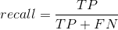

# More about performance: metrics and plots

> #### Questions
> 
> 1.	How can I measure the quality of a classifier?
> 
> #### Objectives
> 
> 1.   Introduce useful metrics for evaluating a classifier's performance.
> 2.   Introduce plotting techniques for visual exploration of a classifier's performance.

In model validation / evaluation, 
we ask our classifiers to predict labels given feature vectors in the validation / test set. 
We compare the predicted labels and the true labels to get an idea of how well the classifiers perform. 
Now we discuss the metrics and plots that quantitatively measure the quality of a classifier.

### Metrics

We first restrict our discussion to binary classification problems, 
where a sample is either positive (P) or negative (N). 
In practice, the two classes may have different names, 
but we can always consider one as positive and the other as negative. 
Given the true labels and the labels predicted by a classifier, a sample is a

- <b>true positive (TP)</b> if its true label is positive and it is also predicted to be positive.
- <b>true negative (TN)</b> if its true label is negative and it is also predicted to be negative.
- <b>false positive (FP)</b> if its true label is negative but it is predicted to be positive.
- <b>false negative (FN)</b> if its true label is positive but it is predicted to be negative.

If a sample is an FP or FN, we know the classifier made a mistake. 
Given the definitions above, we can summarize the samples in a <b>confusion matrix</b>.

We count the number of TPs, TNs, FPs and FNs and populate the matrix. 
In practice, we may choose to convert the counts into percents by dividing each entry by the row sum. 
In this way, we get a better idea of how the classifier performs with respect to each class.

Now that we have defined some terms, we can use them to introduce some useful metrics.

#### Accuracy

Using the notations above, we write

In other words, it is the number of correctly predicted samples divided by the total number of samples. 
Sometimes, people talk about <b>error rate</b>, which is .

Accuracy gains its popularity because of its simplicity, 
but it is less useful when the classes are <i>imbalanced</i>, 
i.e. when there are way more positive samples than negative samples or the other way around. 
For example, if your dataset has 90 positives and 10 negatives, 
you can easily reach 90% accuracy if you declare all samples as positives. 
Obviously, such a classifier is useless. 

#### Precision

Intuitively, the question being asked is: 
<i>Out of the samples predicted to be positive, how many of them are truly positive?</i> 
Mathematically,

It measures how strongly we can believe the classifier's calls. 
Another way of saying it is how aggressively the classifier is on making calls. 
Precision is high for a conservative classifier but low for an aggressive classifier.

#### Recall

Intuitively, the question being asked is: 
<i> How many of the truly positive samples can the classifier discover (or recall)?</i> 
Mathematically,

It measures how much interesting information can be discovered. 
Recall is high for an aggressive classifier but low for a conservative classifier. 
Recall is also known as <b>sensitivity</b> in statistics.

#### F1 score

F1 score takes both precision and recall into account. 
Mathematically,

For a conservative classifier, F1 score is dominated by recall. 
For an aggressive classifier, F1 score is dominated by precision. 
Given the discussion above, 
a classifier that is either too conservative or too aggressive gets a low F1 score. 
Therefore, F1 score encourages a <i>fair</i> classifier.

All metrics discussed above lie between 0 and 1. 
There are a lot more metrics available, and you should choose the one that captures your concern. 
For example, if your application is cancer screening and a miss has serious consequence, 
then recall is more important to you compared to precision. 
On the other hand, if your application is to screen for potential gene hits 
that you will verify experimentally later, 
and the experiments are extremely expensive and time-consuming, 
then you do not want to be played by the classifier too often, 
so precision is more important than recall. 

We note that although we treated the positive class as the interesting one 
and defined metrics with respect to it, 
we can also define their counterparts for the negative class 
since the two classes can be equally interesting in many applications. 
For example, if your goal is to classify tumors into one of two subtypes, 
there is no reason for only evaluating the classifier with repect to one subtype but not the other.

Furthermore, the metrics we defined above easily generalize when the number of classes grows. 
In practice, people use the <b>one-v.s.-all</b> trick. 
For each class, we consider the samples that belong to this class as positive, 
and all other samples as negative. 
In this way, we can compute, say precision, with respect to each class. 

### Plots

Instead of directly making predictions on class labels, 
many algorithms compute a probability for each class given a feature vector. 
People usually pick a threshold so that a concrete class prediction can be made. 
The ideas of probability estimation and thresholding are explored 
by the two most popular performance plots, <b>ROC curves</b> and <b>precision-recall curves</b>. 
We begin by considering plotting these curves for binary classification problems, 
and later briefly comment on their generalization in multi-class problems.

#### ROC curves

#### Precision-recall curves

> #### Reference
> 
> All images in this lesson are adapted from [Raschka, Sebastian, and Vahid Mirjalili. Python Machine Learning, 2nd Ed. Packt Publishing, 2017.](https://github.com/rasbt/python-machine-learning-book-2nd-edition)
> 
> #### Further readings
> 

