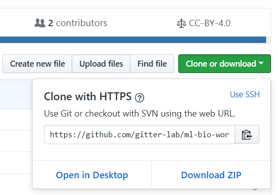

# Workshop setup

> #### Questions
>
> 1.   What do I need to run the ML4Bio software?
> 2.   How do I download the ML4Bio workshop materials?
>
> #### Objectives
>
> 1.   Provide instructions for installing the ML4Bio software.

### Download the ML4Bio materials
To download the ML4Bio materials, visit <https://github.com/gitter-lab/ml-bio-workshop/>.
Click the `Clone or download` button followed by `Download ZIP`.

Save the file `ml-bio-workshop-master.zip` and then open that location on your computer.
Extract the zip file and open the folder `ml-bio-workshop-master`, which has the same contents as <https://github.com/gitter-lab/ml-bio-workshop/>.
You are now ready to install the Python dependencies needed to run the ML4Bio software and follow the workshop exercises.

### Install Python
ML4Bio requires Python and several other Python packages.
The easiest way to install Python and the correct version of these packages is through [Anaconda](https://anaconda.com/), a Python distribution.
If you do not have Anaconda installed, please visit <https://www.anaconda.com/download/> to download and install the Python 3.6 version.
**We recommend letting the Anaconda installer add Anaconda to your computer's `PATH` environment variable so that it is easily accessible from the command line.**
This will also make Anaconda your primary Python distribution.
See the [Carpentries Anaconda installation instructions](http://carpentries.github.io/workshop-template/#python) for a step-by-step guide and video on how to install Anaconda for your operating system.

If you did not add Anaconda to your `PATH` during installation and would like to, follow these instructions for Windows 10:
- Start -> Type "Path" -> Edit environment variables for your account
- Path -> Edit -> New -> Browse -> Browse to the location where Anaconda was installed and select the Scripts subdirectory -> OK -> OK

### Launch the software

After you install Anaconda, return to the `ml-bio-workshop-master` directory and open the `scripts` subdirectory.
There are wrapper scripts that will run ML4Bio inside a conda environment, which is a collection of specific versions of Python packages.
If the environment does not already exist, it will be created.
This can take several 5-10 minutes and requires internet connectivity to download the Python packages.
For Windows, launch the `install_launch_windows.bat` script.
For Mac OS, launch the `install_launch_mac.command` script.
For Linux, launch the `install_launch_linux.sh` script.

Advanced users who already have Python installed can install the [required packages](../scripts/README.md) through pip.
Then launch ML4Bio from the command line with the command `ml4bio`.
