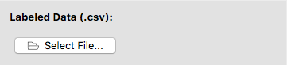
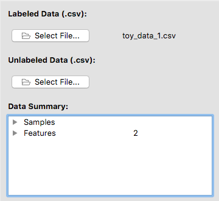

# Software setup and a quick tour

> #### Questions
> 
> 1.   What do I need for running the software?
> 2.   What can I do with the software?
> 
> #### Objectives
> 
> 1.   Provide instructions on installation of the software.
> 2.   Explain how the software works through an example.

### Launch the software 

### A quick example

#### Step 1: load data

Load a .csv file from the disc by clicking on <b>Select File</b>.
- A valid dataset consists of a number of feature columns and a single label column.
- The label column must be the last column.
- Each column has its corresponding name in its first row.

---

After a valid file was loaded, the filename is shown next to the load button.
Now you may optionally load an unlabeled dataset that pairs up with the labeled one.
The two datasets must have the same features.
A summary of the dataset(s) is displayed. 
You may unfold the bullets in the summary to see more details.

---

#### Step 2: split data

Decide how much data you want to set aside for testing.
You may adjust the percent of test data and decide whether or not to split the data in a stratified fashion.
We reserve 20% of the labeled dataset for testing.

---

#### Step 3: choose a validation method

Choose from one of the three supported validation strategies. 
We use 5-fold cross-validation with stratified sampling.

---

#### Step 4: choose classifier type

Use the drop-down menu to select a classifier type.
We select SVM (i.e. support vector machine).

---

#### Step 5: set classifier hyperparameters and train

A list of hyperparameters for an SVM shows up.
We first train an SVM using the default hyperparameter values.
You may give your classifier a name and add some comment at your own discretion.

