# Software setup and a quick tour

> #### Questions
> 
> 1.   What do I need for running the software?
> 2.   What can I do with the software?
> 
> #### Objectives
> 
> 1.   Provide instructions on installation of the software.
> 2.   Explain how the software works through an example.

### Launch the software 

Edit later...

### A quick tour

Once you open the software, it looks as below.

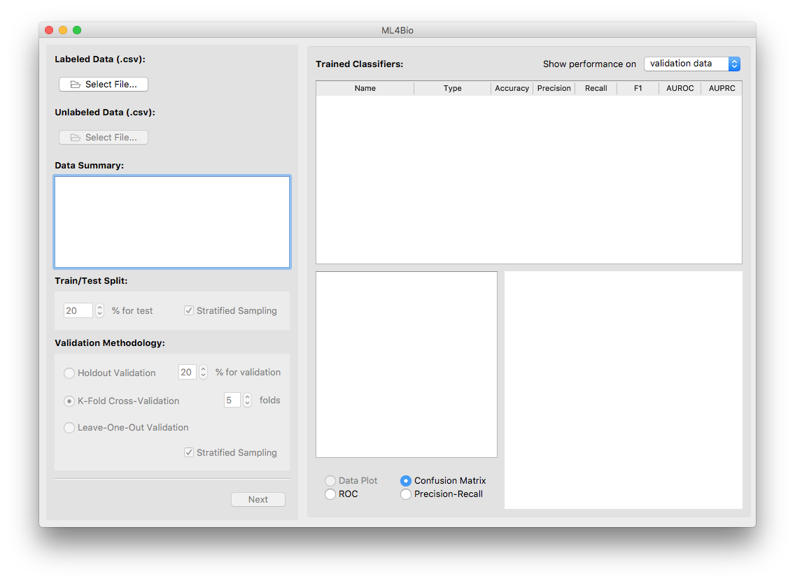

The interface can be divided into three areas:

- <b>Red area.</b> 
This is the main area you operate on. 
It consists of three pages. 
The first page allows you to load data, split data and choose a validation method (steps 1,2 and 3). 
The second page is where you train classifiers (steps 4 and 5). 
The last page is for testing and prediction (steps 6 and 7).

- <b> Yellow area.</b> 
This is where trained classifiers are listed. 
An entry will be added after a classifier is trained. 
Each entry contains six most useful performance metrics 
that assist you in classifier evaluation and selection. 
You will find this area helpful when you train, evaluate and test classifiers.

- <b> Blue area.</b> 
This area is for data provenance and visualization. 
Once a classifier in the yellow area is selected, 
you may examine its hyperparameters, performance metrics and plots 
using the interface provided in this area.

We illistrate the use of the software by working through an example. 
The interface may differ slightly on different operating systems. 

#### Step 1: Load data

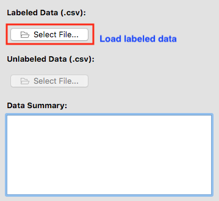

Load a .csv file from the disc by clicking on <b>Select File...</b>. 
Note that

- A valid dataset consists of a number of feature columns and a single label column.
- The label column must be the last column.
- A header is required.

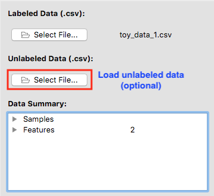

After a valid labeled dataset is loaded, the file name will be shown next to <b>Select File...</b>.

You may optionally load an unlabeled dataset that pairs up with the labeled one.
The two datasets <i>must</i> have the same features.
After you trained a classifier, you may make predictions on the unlabeled data.

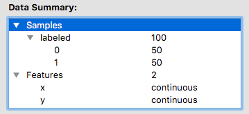

A summary of the dataset(s) is displayed in a tree structure. 
You may unfold the bullets to see more details.
There are a total of 100 samples in the dataset we loaded.
Half of them belong to class 0, and the other half belongs to class 1.
The dataset has only two features, namely x and y.
Both of them are continous.

#### Step 2: Split data

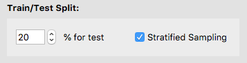

Decide how much data you want to set aside for testing.
You may adjust the percent of test data 
and decide whether or not to split the data in a stratified fashion.
We reserve 20% of the labeled dataset for testing.

#### Step 3: Choose a validation method

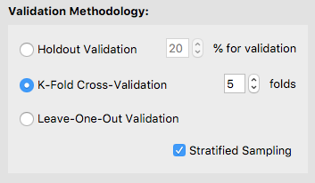

Choose from one of the three supported validation strategies.
Adjust the values accordingly.
We use 5-fold cross-validation with stratified sampling.

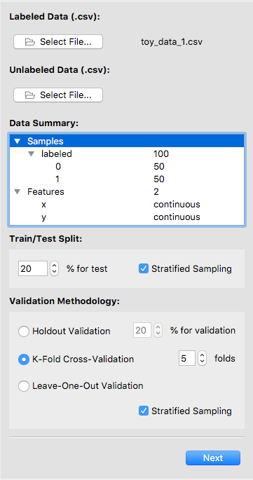

Here is what the left panel (i.e. the red area) looks like after step 3.
We are ready for training classifiers.
Click on <b>Next</b> to go to the next page.

#### Step 4: Set up a classifier

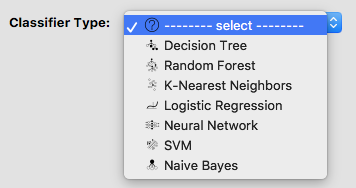

Use the drop-down menu to select a classifier type.
We select SVM (i.e. support vector machine).

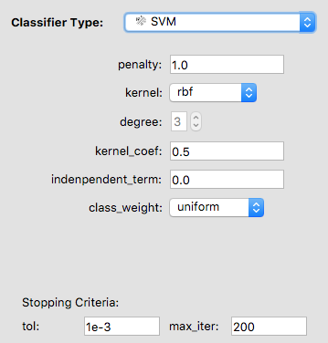

A list of hyperparameters for an SVM shows up.
The meaning of the hyperparameters will be introduced in a later section.
We first train an SVM using the default hyperparameters.

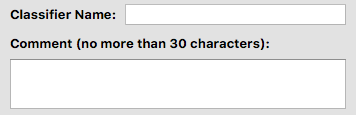

You may give your classifier a name and add some comment. 
If you do not specify a name, the software will use "classifier\_[int]" as its default name.
For example, if the classifier is the third one you trained, its default name is "classifier\_3". 

#### Step 5: Train and evaluate classifiers

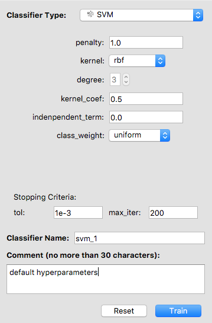

Now everything has been set up for training an SVM. 
If you changed the hyperparameters but want to start over, 
click on <b>Reset</b>.
The hyperparameters will be back to default. 
Otherwise, click on <b>Train</b>.

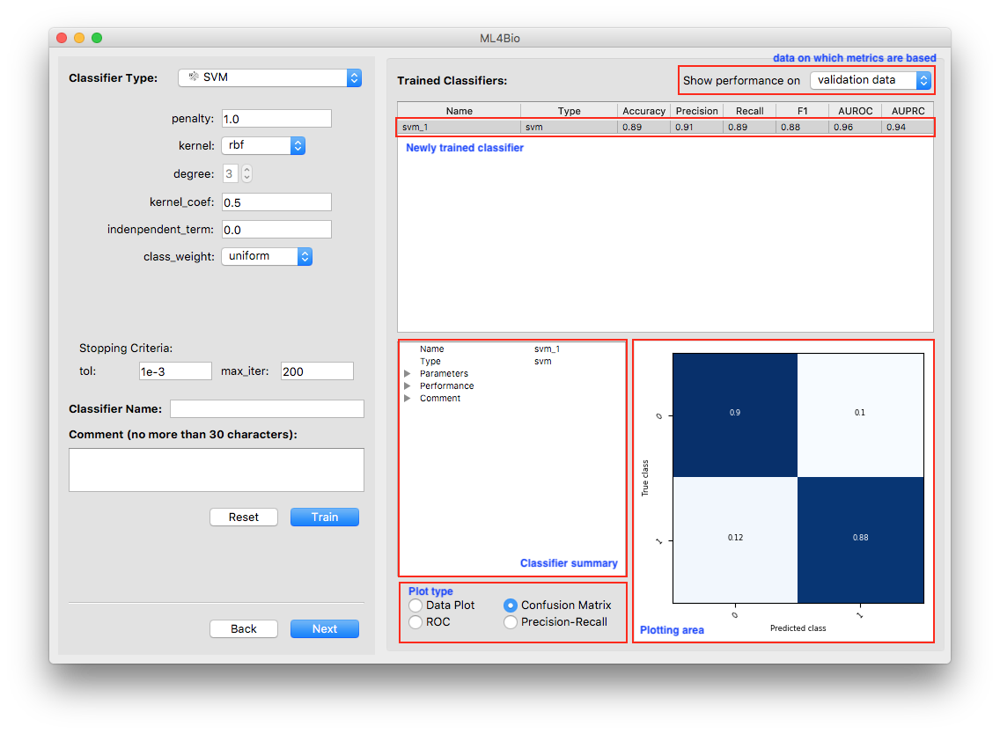

In the yellow area, a new entry was added to the list.
It includes the name, type and the six performance metrics of the newly trained classifier.
<i>Note that the metrics are all with respect to the type of data 
shown at the top-right corner of the yellow area.</i>

There are a few things you can do at this stage:

- <b>Examine classifier summary.</b> 
A summary of the newly trained classifier is presented in the blue area.
As with data summary, you may unfold the bullets to see more details.

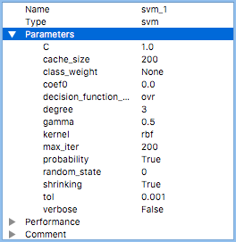
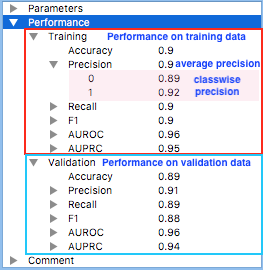

The left figure shows a complete list of classifier hyperparameters. 
Some of them were exposed to you for tuning, others were fixed by the software. 
You may learn more about the hyperparameters from sklearn documentation.

The right figure shows the classifier's performance with respect to different types of data. 
For each metric, classwise values as well as their average are computed. 
For example, the precision of the classifier on class 0 on the training data is 0.89. 
The classifier's overall precision on the training data is 0.9.

- <b> Examine plots.</b>
Three types of plots that reflect the classifier's performance are always available. 
Data plot is only available when the dataset contains exactly two continuous features. 
<i>Note that the plots are all with respect to the type of data 
shown at the top-right corner of the yellow area.</i>

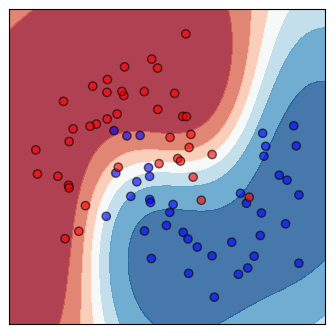
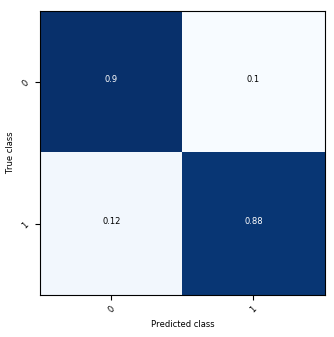

Shown on the left is a scatter plot of the training data and contours of the decision regions. 
The darker the color, the more confident the classifier is. 
Shown on the right is the confusion matrix.

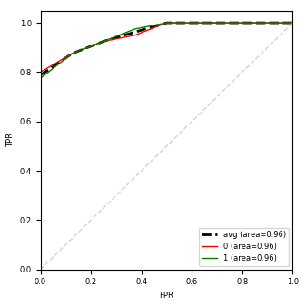
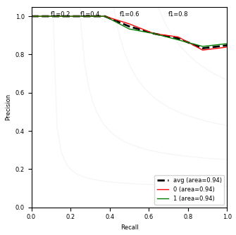

The left figure includes ROC curves and the right one includes precision-recall curves. 
A curve is plotted for each class. 
The average curve is the unweighted average of all classwise curves.

- <b> Switch between performance on different data types.</b> 
You may want to compare the classifier's performance on training and validation data 
to see how well it generalizes. 
Use the drop-down menu at the top-right corner of the yellow area 
to switch between performance on different types of data.

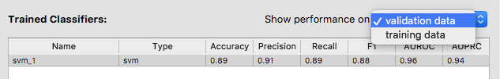

Typically, you will train and evaluate many classifiers 
before you find one that you are satisfied with.
Using the software, you may train as many classifiers as you want.
You may click on the header of the list to sort the classifiers by a particular metric.
For example, if you click on <b>Accuracy</b>, 
the classifiers will be listed in descending order of accuracy.

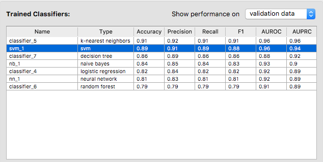

It seems that the SVM we trained first is the second best classifier in terms of accuracy. 
The best one is a k-nearest neighbor classifier that achieves 91% accuracy on the validation data. 

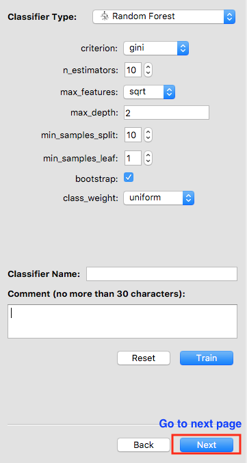

Let's say we are happy about the k-nearest neighbor classifier. 
Click on <b>Next</b> to proceed to the next page.
However, if you want to change, say, the validation method, 
you may click on <b>Back</b>, which will bring to the previous page. 
<i>Be careful, because all trained classfiers will be lost if you do so.</i>

#### Step 6: Test a classifier

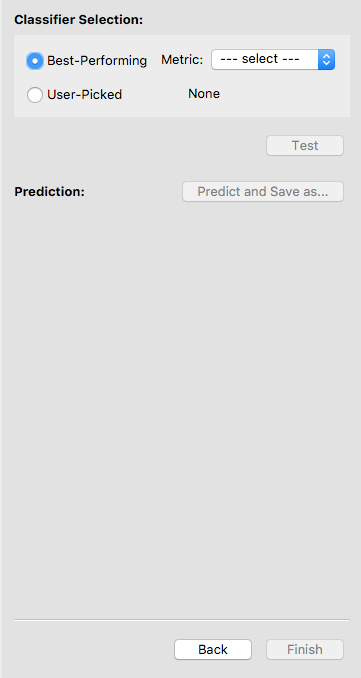

We are done with training and ready to select a classifier for testing. 
However, if you changed your mind and decided to train more classifiers, 
you have a chance to return to the previous page by clicking on <b>Back</b>.

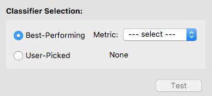

To select a classifier, you may let the software pick one for you by specifying a metric. 
In this case, the software will select the best classifier with respect to that metric. 
Otherwise, you may pick a classifier on your own. 
We let the software select the classifier with the highest accuracy.

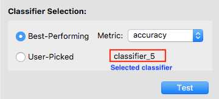

After a classifier is selected, its name will show up. 
Double-check that it is the one you want to test.
Now the <b>Test</b> button is enabled, and you may click on it to test the selected classifier.
<i>Note that once you hit <b>Test</b>, 
you are no longer allowed to go back and train more classifiers.</i>

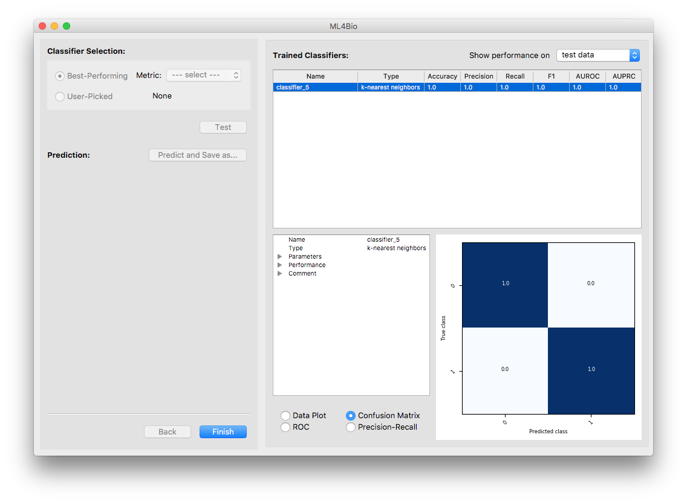

Now the only classifier in the list is the tested one. 
Note that the software is showing the classifier's performance on the test data. 
You may examine the performance using either the summary or the plots.

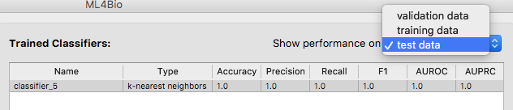

Although not recommended, you are allowed to test any of the other trained classifiers. 
Switch the type of data to either training or validation data 
and you will see the complete list of trained classifiers. 
Test them by following the instruction above.

#### Step 7: Make predictions

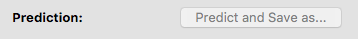

Optionally, you may make predictions on the unlabeled data you uploaded and save the results. 
If no unlabeled data exists, the <b>Predict</b> button is disabled.

Finally, finish your work by clicking on <b>Finish</b>. 
A message box will show up and you may choose from closing the software 
or playing around with a different dataset.