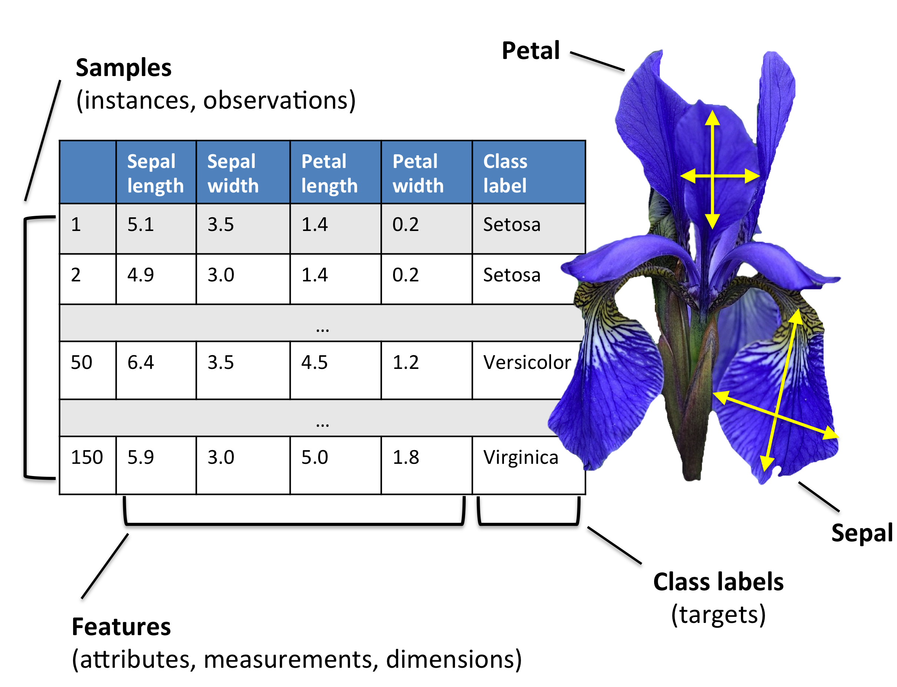
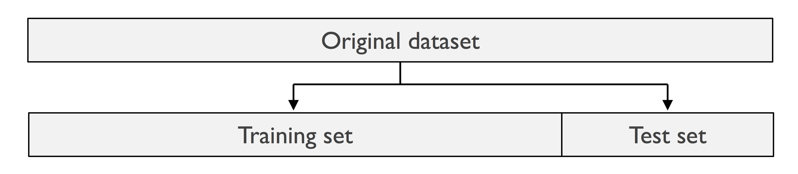
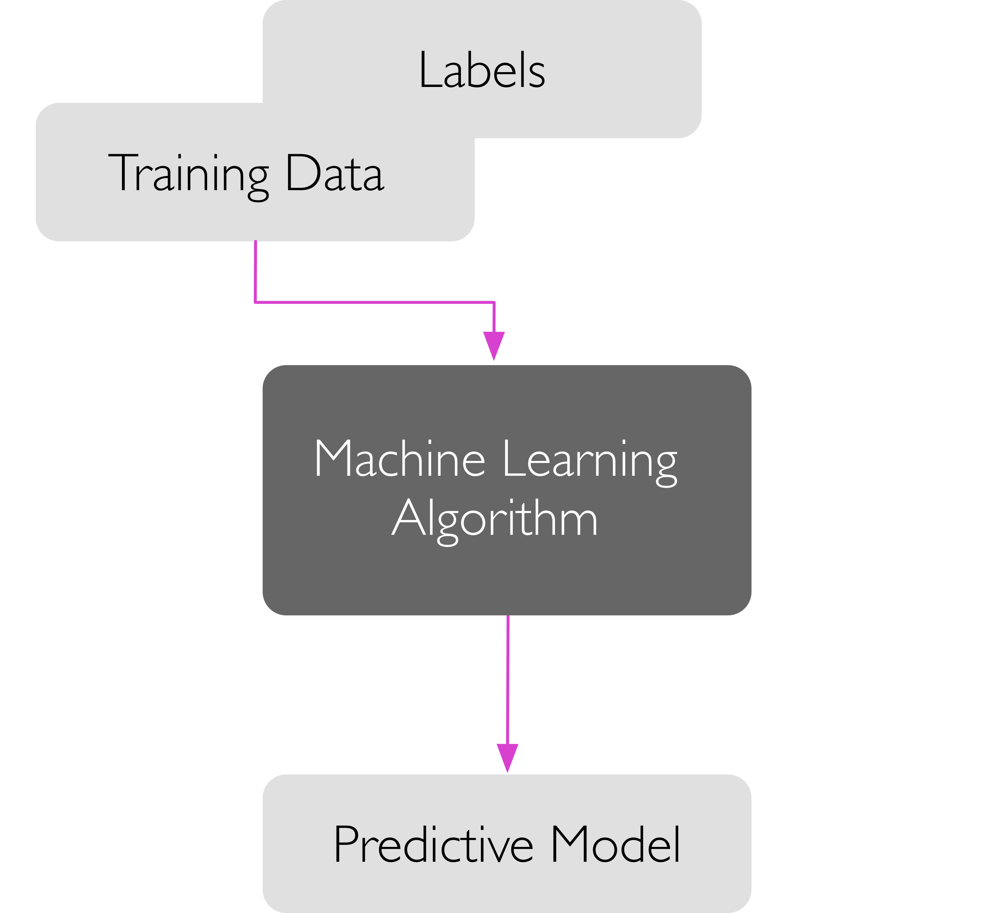
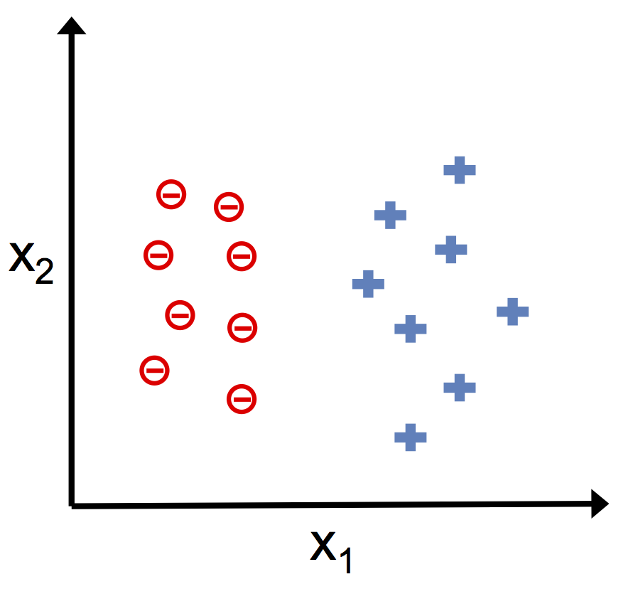
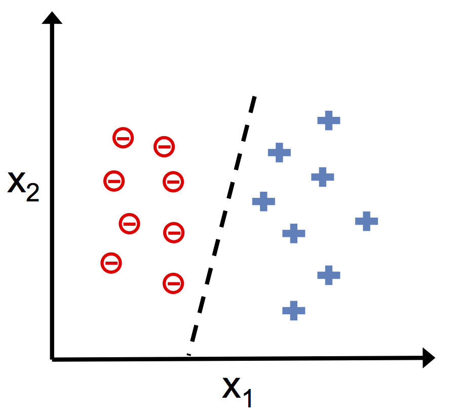
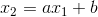
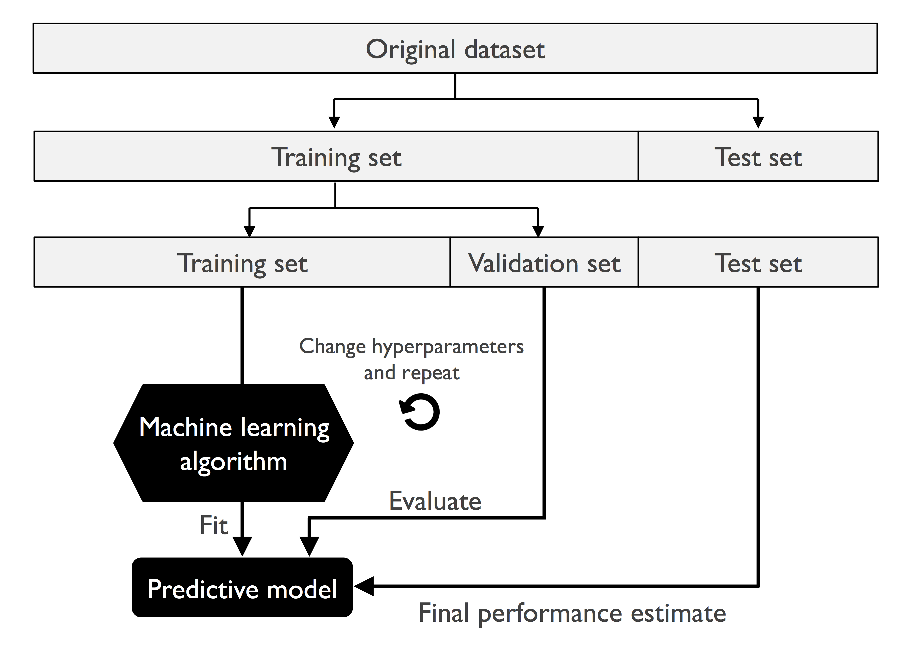
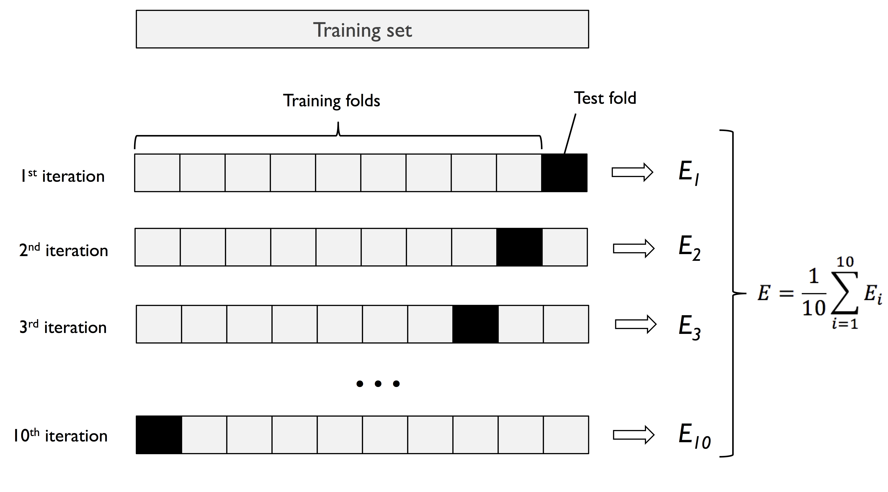

# ML vocabulary and workflow

> #### Questions
> 
> 1.   What are features and labels? What is a classifier?
> 2.   What does it mean by training/testing a classifier?
> 3.	How to use a classifier to make predictions?
> 4. 	What are the major steps in a ML pipeline? What do they do?
> 
> #### Objectives
> 
> 1.   Introduce the basic terminology in ML.
> 2.   Present an overview of a typical ML workflow.

As discussed in a previous lesson, 
machine learning (ML) is about <i>learning</i> some properties of a dataset 
and applying them to previously unseen data. 
In this lesson, we address what precisely learning is.

When people talk about ML, they either mean the general ML workflow, 
a multi-step procedure for generating insight from data, or ML algorithms, 
which are at the core of the workflow. 
We start by introducing the workflow at a high level, and then dive into each step of it.

### ML workflow: an overview

A typical ML pipeline consists of four steps:

- <b>Preprocessing.</b> Transform raw data into datasets that can be fed into an ML algorithm. 
- <b>Learning.</b> Train a set of classifiers using the training set and select the best one.
- <b>Evaluation.</b> Evaluate the best classifier on the test set.
- <b>Prediction.</b> Apply the classifier to produce labels for new data.

It is completely fine if some of the terms are unfamiliar to you. 
We will encounter them again when we discuss each step in depth.

### Step 1: Preprocessing

In biological applications, raw data can rarely be immediately fed into a learning algorithm. 
Here is why:

- Many large-scale datasets are in the form of sequences, spectra, text or images. 
Although some algorithms can take them directly as input, many others cannot. 

- Raw data is usually corrupted by noise, error, missing values and misspellings. 
Besides, data from various sources may be annotated in different ways. 
For example, "July 23" and "7/23" refer to the same date, 
but they look different from the perspective of an algorithm.

- Sometimes there are too many variables compared to the number of samples. 
Many variables are not informative, but their presence may corrupt the performance of an algorithm. 
Hence, they should be removed prior to learning. 
For example, RNA-seq data contains values for thousands of genes, 
and most of them are not differentially expressed across conditions.

- Data is often a mixture of string and numerical values. 
Many algorithms can only handle numerical features. 
Even if the features are all numerical, they may live in vastly different scales, 
which has huge (and often negative) impact on the performance of some algorithms.

Data preprocessing for ML is a robust research area. 
Techniques for addressing the issues above include, but are not limited to, 
feature extraction and selection, data cleaning and integration, 
missing value imputation, dimensionality reduction and data encoding.
We will not spend much time on this topic due to time constraint. 
All datasets we will encounter are already in good shape.
The only possibly needed preprocessing step is encoding, which we will briefly discuss below.

#### Dataset structure

We use the famous iris dataset to introduce the basic language for describing a dataset.

Most datasets for ML are orgarized in a similar fashion. 
A dataset can be regarded as a table, where a row corresponds to a sample 
and a column except for the last one corresponds to a feature. 
The last column contains labels and is usually called the label column. 

- A <b>sample</b> is a data point. It is comprised of a <b>feature vector</b> and a label.
The samples are assumed to be independently drawn from an underlying distribution, or a population. 
The iris dataset contains 150 samples. 
In the first sample, the feature vector is [5.1, 3.5, 1.4, 0.2], and the label is Setosa.

- A <b>feature</b> captures one aspect of the population. 
It can be real-valued as in the iris dataset. 
In other cases, a feature may be integer- or string-valued. 
There are four features in the iris dataset, 
namely sepal length, sepal width, petal length and petal width.

- A <b>label</b> is the property we want to predict from the features. 
For classification tasks, a label takes a value from a finite (and typically small) set of <b>classes</b>. 
Each sample in the iris dataset belongs to one of the three classes, 
namely Setota, Versicolor and Virginica.

Notice the diversity in how people call these basic structures. 
Samples are also called items, examples, instances and observations. 
Features are also known as variables, attributes, measurements and dimensions. 
Labels, classes and targets may be used interchangably.

#### Data encoding

When some features are categorical (i.e. have integer or string values), 
it is often necessary to <b>encode</b> data using one of the following techniques 
such that it can be understood by algorithms that only deal with numerical values.

- <b>Integer encoding.</b> 
Feature values are replaced by integers. 
The same value is mapped to the same integer. 
For example, if blood pressure is a feature that has values <i>low</i>, <i>medium</i> and <i>high</i>, 
one possibility is to map <i>low</i> to <i>0</i>, <i>medium</i> to <i>1</i>, 
and <i>high</i> to <i>2</i>. 
Notice the mapping makes sense because it preserves the natural ordering. 
Integer encoding is used when there exists intrinsic ordering in feature values
and you want to preserve it in the encoded values. 
If the original values are not ordinal, 
integer encoding is only appropriate for algorithms that are insensitve to ordering.

- <b>One-hot encoding.</b> 
Feature values are transformed into indicator vectors. 
An indicator vector has all but one entries equal to 0. 
The remaining entry equals 1. 
In this way, we create new features, each of which corresponds to one original feature value. 
In the same blood pressure example, one-hot encoding turns this feature into three new features 
corresponding to low, medium and high pressure, respectively. 
If a value is originally <i>low</i>, it gets transformed into the indicator vector [1, 0, 0]. 
Similarly, <i>medium</i> gets [0, 1, 0], and <i>high</i> gets [0, 0, 1]. 
One-hot encoding does not introduce arbitrary ordering, 
but may cause loss of information when there is indeed some ordering in the original feature.

In this workshop, you do not need to encode data on your own. 
The software does it for you. 
However, it is important to keep in mind 
that encoding is an important step in preprocessing and makes a real impact in subsequent steps.

#### Data splitting

Assume we have a dataset that is compatible with most classification algorithms. 
Before getting into the learning step, we split this dataset into two subsets, 
one for <b>training</b> and the other for <b>testing</b>. 
In practice, people reserve 20% to 30% of the full dataset for testing.

The training set is used in the process of obtaining a classifier. 
The classifier is then evaluated on the test set 
so that an <i>unbiased</i> estimate of accuracy and other performance metrics are computed. 
The test set should be completely hidden from the learning algorithm until it is time for evaluation. 
Improper use of test set may cause <b>overfitting</b>. 
In plain words, the algorithm cheated and reported overoptimistic performance. 
We will illustrate the concept of overfitting when we practice on the software.

### Step 2: Learning

The central component of the learning step is learning algorithms. 
Given a training set, a learning algorithm outputs a predictive model, which in our case is a classifier. 

We may further divide learning into three steps: training, validation and selection. 

#### Training

We start from an example of <b>training</b>. 
Suppose there are a bunch of labeled samples in a two-dimensional space, 
and we want to find a straight line that separates the positive samples from the negative samples. 
The problem setting is illustrated in the left figure. 

Any straight line divides the space into two sides. 
We can classify all points on one side as positive and those on the other side as negative. 
Hence, straight lines can be considered as a set of classifiers. 
They have the form 

where  and  are features, 
and  and  are <b>parameters</b>. 
Any straight line classifier is uniquely determined by the two parameters. 
Intuitively, the <i>best</i> line separates all negative samples from all positive samples. 
Fortunately, there exist many such lines, and one of them is shown in the right figure. 
Finding a <i>best</i> line is equivalent to finding the parameters that define it. 
A learning algorithm attempts to find a <i>best</i> line through parameter search.
For each set of parameters, it checks how many mistakes the corresponding classifier makes.
It stops when all samples are classified correctly, and reports the current classifier as the best one. 

In practice, most types of classifiers are more complex than straight lines. 
Many of them have <b>hyperparameters</b>, 
which are different from parameters in that they are tuned by human users, not learned.
In general, training takes three steps: 

- <b>Choose classifier type.</b>
This restricts us to a specific set of classifiers in the universe of all possible classifiers.
In the example above, we are interested in straight lines, a set of linear classifiers. 
Random forests, neural networks, SVMs, etc. that we will cover later are all popular types of classifiers.

- <b>Set hyperparameters</b> (if applicable). 
This further restricts us to a subset of the set of classifiers determined in the previous step. 
The straight lines, given its simplicity, have no hyperparameters. 
Number of trees in a random forest, number of hidden nodes in a neural network 
and type of kernel in an SVM are all tunable hyperparameters.

- <b>Apply a learning algorithm.</b> 
The algorithm searches for the <i>best</i> classifier within the subset determined in the previous step. 
It is worth noting that people usually do not distinguish between 
a learning algorithm and the classifier it produces. 
For example, decision tree can either mean the algorithm for building a tree or the tree itself. 
The precise meaning can often be inferred from the context.
 
We construct an <b>objective function</b> (a.k.a. loss function, cost function) 
to quantify what we mean by <i>best</i>. 
The objective function contains a <b>loss term</b> and sometimes a <b>regularization term</b>. 
A loss term represents the price paid for inaccuracy, 
and is often the number of mistakes made in classification. 
It suffices to know that a regularization term encourages generalization 
(i.e. how well a classifier performs on unseen data).
The <i>best</i> classifier is the one that minimizes the objective function. 
<i>In essence, a learning algorithm solves a minimization problem over the space of parameters.</i>
It keeps minimizing the objective function until it <b>converges</b>, 
i.e. when no further improvement can be made.

Finally, we note that some type of classifiers are not defined by a fixed number of parameters. 
Their structure is more flexible and depends on training data. 
Decision tree is one such example.
However, it remains true that training is the process of 
finding the classifier that minimizes some objective function. 

#### Validation

Suppose we end up with the best classifier with respect to our objective function. 
If that is all we want, we will proceed to the evaluation step.
However, we are often not satisfied with a single classifier. 
We may want to

- <b>train classifiers of different types.</b> 
For example, we trained a decision tree, but also want an SVM, hoping that it may be better suited for our data.

- <b>train classifiers of the same type, but with different hyperparameters</b>. 
By tuning hyperparameters, we explore different subsets of classifiers defined by its type. 
For example, a neural network with ten hidden units supports richer structure 
compared to one with only two hidden units.

In order to compare multiple classifiers with respect to different types or hyperparameters, 
we need some data that has not been used for training. 
Test set sounds a good option, but we are not there yet. 
If we were to use the test data, we would not be able to evaluate the classifier we eventually select. 
The basic solution is to allocate a small portion of the training set as the <b>validation set</b>. 
The figure below illustrates the idea.

Validation is the same as evaluation except that it is performed on validation set, not test set. 
The classifiers take feature vectors in the validation set as input and outputs predicted labels. 
An estimate of accuracy is computed by comparing the predicted and true labels. 
There are other commonly used performance metrics, but we postpone the discussion until a subsequent lesson. 

There are three popular validation methods:

- <b>Holdout validation.</b>
This scheme completely agrees with the figure above. 
We hold out a small fraction of the initial training data as our validation set. 
The rest of the training data becomes the actual training set. 
Classifiers are trained on the new training set and validated on the validation set.

- <b>K-fold cross-validation.</b> 
The initial training set is divided into k subsets or <b>folds</b>. 
We iterate through all folds, use the current fold as validation set and the rest k-1 folds as training set. 
Average over the metrics on each fold to form overall metrics. 
This is summarized in the figure below. 
K-fold cross validation makes more efficient use of data.

- <b>Leave-one-out validation.</b> 
This is a special case of K-fold cross validation, where k equals the number of samples. 
Each time, all but one samples are for training and the remaining sample is for validation. 
Leave-one-out validation is often used when data size is small.

Note that all classifiers must be consistently validated using the same method.

#### Selection

The purpose of validation is to produce unbiased, comparable metrics for model selection. 
Now, we can set up our own criteria for selecting a final classifier. 
We may take the following measures into account.

- <b>Performance.</b> 
For example, we may select the classifier with the highest accuracy. 
Other metrics exist and will be introduced later.

- <b>Complexity.</b> 
For two classifiers that exhibit comparable performance, we may prefer the one with simpler structure. 
This is because overcomplicated classifiers are more vulnerable to overfitting. 
This is especially true for high-dimensional data.

- <b>Intepretability.</b> 
In many biological applications, we care about understanding the system. 
Some classifiers, such as decision trees or a logistic regression classifiers, are more informative than others
because they reveal the critical features in decision-making.

### Step 3: Evaluation

Given the selected classifier, now it is time for testing it. 
But before that, a common practice is to retrain this classifier 
on the combination of training and validation data. 
The testing procedure is the same as validation except that we now use the test set. 
Given the feature vectors in the test set, the classifier produces the predicted labels. 
Compare them with the true labels to estimate the performance of the classifier. 
Since the test set has never been touched before, 
it is reasonable to believe that the metrics on the test set are unbiased 
and thus are indicative of the classifier's performance on future data.

### Step 4: Prediction

The main purpose of ML is to generate a classifier for production. 
Instead of labeling new data manually, we can now let the classifier predict the labels for us.

> #### Reference
> 
> All images in this lesson are adapted from [Raschka, Sebastian, and Vahid Mirjalili. Python Machine Learning, 2nd Ed. Packt Publishing, 2017.](https://github.com/rasbt/python-machine-learning-book-2nd-edition)
> 
> #### Further readings
> 
> 1.   We scratched the surface of data preprocessing. Here are some tutorials on this topic. [Feature selection](http://scikit-learn.org/stable/modules/feature_selection.html#feature-selection), [Preprocessing](http://scikit-learn.org/stable/modules/preprocessing.html), [Dimentionality reduction](http://scikit-learn.org/stable/modules/unsupervised_reduction.html)
> 2.   Feature engineering is very problem specific. Unfortunately, there is no comprehensive review on this topic. Here are some recent papers on feature engineering in selected domains. [Epigenomics](https://www.ncbi.nlm.nih.gov/pmc/articles/PMC4402699/), [Proteomics](https://academic.oup.com/bioinformatics/article/31/21/3429/194375), [Microbiomes](https://bmcbioinformatics.biomedcentral.com/articles/10.1186/s12859-018-2205-3)
> 3.	A [cheatsheet](http://scikit-learn.org/stable/tutorial/machine_learning_map/index.html) on choosing the right ML models for your data.
